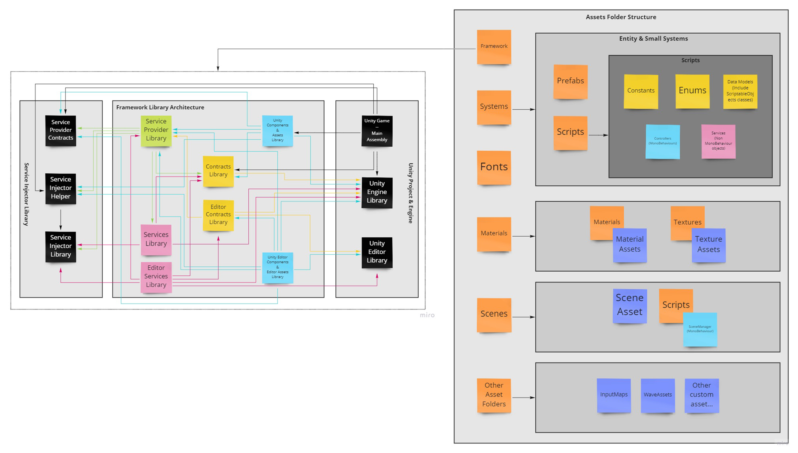
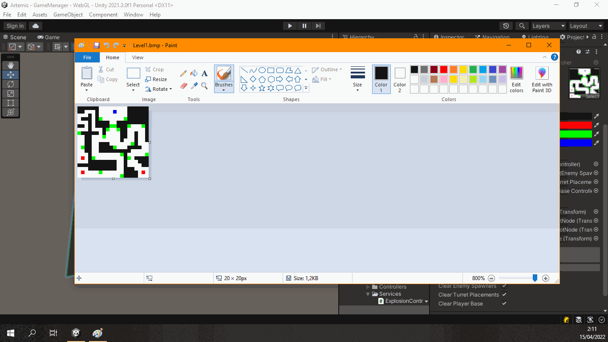
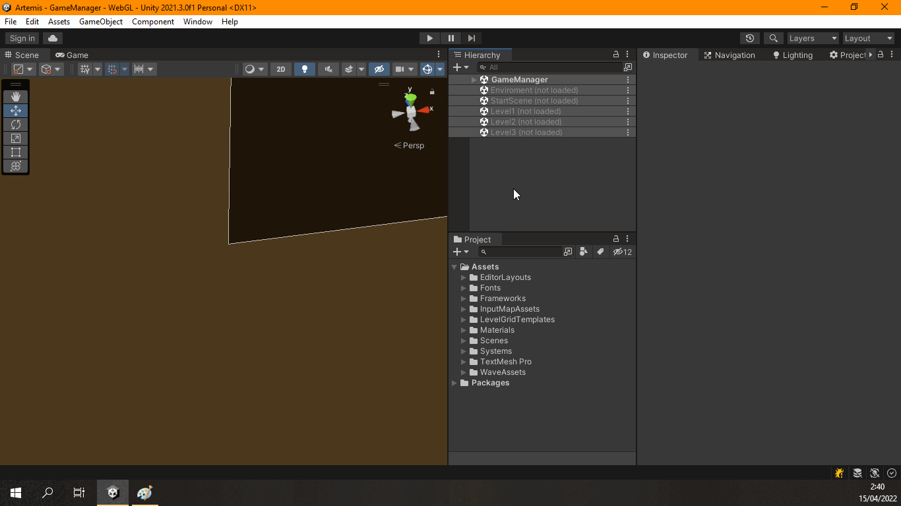

# Artemis
Little Tower Defense game developed in Unity as technical test for a job interview.

## Description
Without enter in details in the full requeriments, basically this technical test required to implement a tower defense game with simple rules, a few type of enemies and turrets, with his own behaviours, a player base as enemy target, a customizable enemy wave system, a simple enconomy system (earning credits killing enemies to buy new turrets) and a few levels, including some optional features like life bars for enemies and turrets.

The game implements 3 types of enemies, with different sizes, life, damages and rewards, 3 types of turrets, with different weapons and prices, and 3 levels (only the first level is "fair" to play. The other ones hasn't have equilibrated designs).

## Architecture
I decided to try an architecture based on services using a IoC system on Unity, using a custom solution to implement the dependecy injection and inversion of control:  [Argos.Framework.ServiceInjector](https://github.com/VisualStudioEX3/Argos.Framework.ServiceInjector).

The project implements a framework with the services needed to implement the game, like a generic object pool implementation or a custom input manager, this last one that ease setup input map actions through scriptable object assets. This input map scriptable objects allow to define the player actions based on keyboard and mouse inputs (primary and secondary bindings for each action like in common games).

The other part is the game itself, where implemented the all components, tools and Unity systems using the framework services.

The next scheme shows the architecture implemented in the project:

## Level generator
In order to ease me testing and prototyping levels quickly, I implemented and old idea used in a game jam several years ago (in this game [Campus Party 2008 Aquanoid 2k8](https://portfolio.visualstudioex3.com/2008/04/12/aquanoid-cp2k8/)). The levels are a 20x20 grid. I implemented an editor tool that reads a BMP file, defining a color setup for each level element: walls, turret placements, enemy spawners and player base. The editor creates in design time the levels placing the prefabs.

This method has a little issue. The enemy AI using the Unity built-in NavMesh system to navigate to the player base. Each time you generate a new level, you must manually update the NavMesh setup for this scene. Despite this issue, the process is instantanelly, so you can fast test new designs or changes in the level, and using a Paint or your favourity image editor to design the levels.

## Controls
The predefined controls to play the game are:
- **Mouse right click** or **Shift** + **Arrows**: Moves the camera over the level. With the mouse, the direction is defined by the position of the mouse from the center of the screen.
- **Mouse left click**: Over a turret placement, the glowing green cubes, open the turret store window.
- **Mouse scroll wheel** or **+** and **-** (numpad keys): Controls the camera zoom.

You can change this setup on **Navigation.asset** and **TurretPlacement.asset** on **Assets/InputMapAssets** folder. 

## Credits and other information
- Developed with Unity 2021.2.3f1 (updated to Unity 2021.3.0f1 LTS).
- Using [KenPixel font family](https://www.kenney.nl/assets/kenney-fonts) and [Prototype Textures 1.0](https://www.kenney.nl/assets/prototype-textures), created/distributed by Kenney (www.kenney.nl) License: [(Creative Commons Zero, CC0)](http://creativecommons.org/publicdomain/zero/1.0/)
